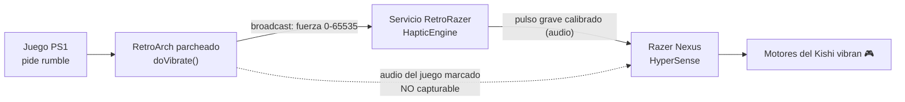

<!-- Idioma: Español -->
[English](README.md) · **Español** · [日本語](README.ja.md)

# RetroRazer

**Rumble real de los juegos para el Razer Kishi V2 Pro en RetroArch (Android).**

Convierte los comandos de vibración reales de los juegos emulados (PlayStation 1,
GBA y más) en vibración de los motores hápticos **HyperSense** del **Razer Kishi
V2 Pro** — algo que promete la caja del control pero que RetroArch nunca lograba
por sí solo.

> Estado: **funcionando y validado en hardware real** (Razer Kishi V2 Pro,
> RetroArch 1.20.0 aarch64). Reproduce fielmente el rumble del juego, separado y
> limpio del audio.

---

## El problema

Los motores del Kishi V2 Pro **no** se controlan con la API estándar de vibración
de Android (`InputDevice.getVibrator()` reporta **sin vibrador**). Se controlan con
**Razer HyperSense / Audio Haptics** mediante la app **Razer Nexus**, que convierte
el **audio del juego** en vibración. Por eso:

- El rumble de RetroArch nunca llegaba a los motores (API equivocada).
- El audio-a-vibración simple vibra con el *sonido*, no con el rumble real del
  juego — se siente vago e impreciso.

## Cómo lo resuelve RetroRazer

Usamos a propósito el motor audio-háptico del control, pero le damos una señal
precisa derivada del **comando de rumble real**, y evitamos que el propio audio del
juego se filtre a la háptica.

1. **RetroArch parcheado** — una llamada inyectada en `doVibrate` emite por
   broadcast la fuerza real del rumble. Una segunda inyección marca el audio de
   RetroArch como *no capturable* para que Nexus ignore el sonido del juego.
2. **App RetroRazer** — un servicio en primer plano recibe la fuerza y genera un
   **pulso grave de audio** calibrado, proporcional a ella.
3. **Razer Nexus HyperSense** convierte ese pulso — y *solo* ese pulso — en
   vibración de los motores.

Resultado: el control vibra **cuando y como el juego lo pide**, no con cualquier
sonido.

---

## Descargar e instalar (sin PC)

Dos APK, compilados en la nube (GitHub Actions). Abre estos enlaces **en el celular**:

| App | Enlace |
|---|---|
| **RetroRazer Rumble Bridge** (nuestra app) | [`apk-latest`](https://github.com/XipleETH/RetroRazer-/releases/download/apk-latest/RetroRazer-RumbleBridge-debug.apk) |
| **RetroArch (parcheado)** | [`retroarch-latest`](https://github.com/XipleETH/RetroRazer-/releases/download/retroarch-latest/RetroArch-RetroRazer.apk) |

## Puesta en marcha

1. Instala ambos APK. *(Si ya tienes el RetroArch oficial, desinstálalo primero —
   mismo package, firma distinta.)*
2. Abre **RetroRazer Rumble Bridge** → **Iniciar puente de rumble** (aparece una
   notificación persistente).
3. **Razer Nexus** → Audio Haptics = **Alta**. Sube el volumen de multimedia.
4. En el RetroArch parcheado, carga un juego de PS1 y en *Opciones del núcleo* pon
   el mando en **DualShock/analógico** y **Rumble = ON** (ver
   [`docs/RETROARCH-CONFIG.es.md`](docs/RETROARCH-CONFIG.es.md)).
5. Juega — el Kishi vibra con el rumble real del juego.

---

## Contenido del repo

- **`rumble-bridge/`** — la app Android: `HapticEngine` (audio→háptica),
  `RumbleHapticService` (el puente) y un **Laboratorio háptico** para calibrar la
  señal.
- **`patches/retroarch/`** — la inyección smali (`RRBridge.smali`) y el script que
  parchea el APK oficial de RetroArch.
- **`.github/workflows/`** — builds en la nube: `build-apk.yml` (nuestra app) y
  `patch-retroarch.yml` (descarga, parchea, firma y publica RetroArch).
- **`docs/`** — análisis técnico y guías de configuración.

## Compilar / reconstruir

Todo se compila en la nube al hacer push; los APK se publican en releases rodantes
(`apk-latest`, `retroarch-latest`). Para reconstruir el RetroArch parcheado a mano,
ejecuta el workflow **Patch RetroArch** desde la pestaña Actions (puedes pasar otra
`apk_url` si hiciera falta).

## Límites honestos

- El pulso háptico se mezcla en el audio (un leve zumbido grave durante el rumble);
  afina frecuencia/forma de onda en el Laboratorio háptico si te molesta.
- El parche depende del método `doVibrate` de RetroArch; una versión futura podría
  renombrarlo (el workflow avisa fallando).
- Firma de depuración: no puede coexistir con el RetroArch oficial.

## Créditos

Construido en colaboración con Claude Code. Razer, Kishi, HyperSense, Nexus y
RetroArch son marcas de sus respectivos dueños; este es un proyecto independiente y
sin fines comerciales.
