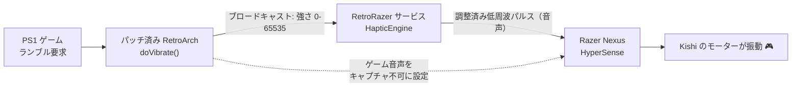

<!-- 言語: 日本語 -->
[English](README.md) · [Español](README.es.md) · **日本語**

# RetroRazer

**Android の RetroArch で、Razer Kishi V2 Pro に本物のゲーム内ランブルを。**

エミュレートされたゲーム（PlayStation 1、GBA など）の実際のランブル命令を、
**Razer Kishi V2 Pro** の HyperSense 触覚モーターの振動へと変換します。これは
コントローラーの箱が約束しているのに、RetroArch 単体では実現できなかった機能です。

> ステータス: **実機で動作確認済み**（Razer Kishi V2 Pro、RetroArch 1.20.0
> aarch64）。ゲームのランブルを忠実に再現し、ゲーム音声とはきれいに分離されます。

---

## 問題

Kishi V2 Pro のモーターは、Android 標準のランブル API では駆動**できません**
（`InputDevice.getVibrator()` は「バイブレーターなし」を返します）。モーターは
**Razer HyperSense / Audio Haptics** によって、**Razer Nexus** アプリ経由で、
**ゲーム音声**を振動に変換して駆動されます。そのため:

- RetroArch のランブルはモーターに届きませんでした（API が違う）。
- 単純な音声→触覚変換は「音」に反応して振動し、ゲームの実際のランブルには反応
  しないため、曖昧で不正確に感じられます。

## RetroRazer の解決方法

コントローラーの音声触覚エンジンをあえて利用しつつ、**実際のランブル命令**から
生成した正確な信号を送り込み、さらにゲーム自身の音声が触覚に漏れ込まないように
します。

1. **パッチ済み RetroArch** — `doVibrate` に注入した 1 行が、実際のランブルの強さ
   をブロードキャストします。もう 1 つの注入で RetroArch の音声を*キャプチャ不可*
   に設定し、Nexus がゲームの音を無視するようにします。
2. **RetroRazer アプリ** — フォアグラウンドサービスが強さを受け取り、それに比例
   した**調整済みの低周波音声パルス**を生成します。
3. **Razer Nexus HyperSense** が、そのパルス（そしてそのパルス*だけ*）をモーター
   の振動に変換します。

結果として、コントローラーは**ゲームが命じたとおりのタイミングと強さで**振動し、
無関係な音では振動しません。

---

## ダウンロードとインストール（PC 不要）

クラウド（GitHub Actions）でビルドされた 2 つの APK です。**スマホで**次のリンクを
開いてください:

| アプリ | リンク |
|---|---|
| **RetroRazer Rumble Bridge**（本アプリ） | [`apk-latest`](https://github.com/XipleETH/RetroRazer-/releases/download/apk-latest/RetroRazer-RumbleBridge-debug.apk) |
| **RetroArch（パッチ済み）** | [`retroarch-latest`](https://github.com/XipleETH/RetroRazer-/releases/download/retroarch-latest/RetroArch-RetroRazer.apk) |

## セットアップ

1. 両方の APK をインストールします。*（公式 RetroArch を既にお持ちの場合は先に
   アンインストールしてください — 同じパッケージ名で署名が異なるため。）*
2. **RetroRazer Rumble Bridge** を開き → **ランブルブリッジを開始**（常駐通知が
   表示されます）。
3. **Razer Nexus** → Audio Haptics = **High（高）**。メディア音量を上げます。
4. パッチ済み RetroArch で PS1 のゲームを起動し、*コアオプション*でコントローラーを
   **DualShock/アナログ**、**Rumble = ON** に設定します
   （[`docs/RETROARCH-CONFIG.ja.md`](docs/RETROARCH-CONFIG.ja.md) 参照）。
5. プレイ — Kishi がゲームの実際のランブルで振動します。

---

## リポジトリの構成

- **`rumble-bridge/`** — Android アプリ: `HapticEngine`（音声→触覚）、
  `RumbleHapticService`（ブリッジ）、信号を調整する **Haptic Lab**。
- **`patches/retroarch/`** — smali 注入（`RRBridge.smali`）と、公式 RetroArch APK
  にパッチを当てるスクリプト。
- **`.github/workflows/`** — クラウドビルド: `build-apk.yml`（本アプリ）と
  `patch-retroarch.yml`（RetroArch のダウンロード・パッチ・署名・公開）。
- **`docs/`** — 技術解説とセットアップガイド。

## ビルド / 再ビルド

push するたびにクラウドでビルドされ、APK はローリングリリース
（`apk-latest`、`retroarch-latest`）に公開されます。パッチ済み RetroArch を手動で
再ビルドするには、Actions タブから **Patch RetroArch** ワークフローを実行します
（必要に応じて別の `apk_url` を渡せます）。

## 正直な制約

- 触覚パルスは音声ストリームに混ざります（ランブル中にかすかな低音のうなり）。
  気になる場合は Haptic Lab で周波数・波形を調整してください。
- このパッチは RetroArch の `doVibrate` メソッドに依存します。将来のバージョンで
  名前が変わる可能性があります（その場合ワークフローは明示的に失敗します）。
- デバッグ署名のため、公式 RetroArch とは共存できません。

## ライセンス

- **RetroRazer 独自のコード**（`rumble-bridge/` のアプリと `patches/` のツール）は
  **MIT ライセンス**で公開しています — [`LICENSE`](LICENSE) を参照。
- リリースで公開している**パッチ済み RetroArch APK** は RetroArch の*改変ビルド*で、
  **GNU GPLv3** で配布されます。対応するソースは、本家 RetroArch
  （<https://github.com/libretro/RetroArch>）に本リポジトリ
  [`patches/retroarch/`](patches/retroarch/) の改変を加えたものです。**非公式**
  ビルドです。
- Razer、Kishi、HyperSense、Nexus、RetroArch は各所有者の商標です。本プロジェクトは
  独立した非営利プロジェクトであり、Razer や RetroArch とは提携していません。
  Claude Code との協働で開発。
