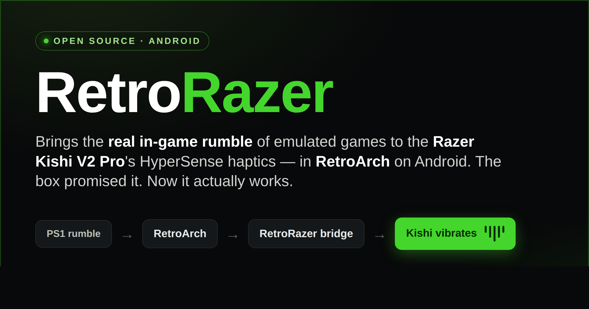
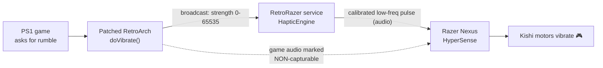

<!-- Language: English (default) -->
**English** · [Español](README.es.md) · [日本語](README.ja.md)

# RetroRazer

**Real in-game rumble for the Razer Kishi V2 Pro in RetroArch on Android.**

Turns the actual rumble commands of emulated games (PlayStation 1, GBA, and more)
into vibration on the **Razer Kishi V2 Pro**'s HyperSense haptic motors — something
the controller's box promises but that RetroArch never delivered on its own.

> Status: **working and validated on real hardware** (Razer Kishi V2 Pro, RetroArch
> 1.20.0 aarch64). It faithfully reproduces the game's rumble, cleanly separated
> from game audio.

---

## The problem

The Kishi V2 Pro's motors are **not** driven by the standard Android rumble API
(`InputDevice.getVibrator()` reports **no vibrator**). They are driven by
**Razer HyperSense / Audio Haptics** through the **Razer Nexus** app, which turns
**game audio** into vibration. So:

- RetroArch's rumble never reached the motors (wrong API).
- Plain audio-to-haptics vibrates on *sound*, not on the game's real rumble — it
  feels vague and wrong.

## How RetroRazer solves it

We use the controller's audio-haptics engine on purpose, but feed it a precise
signal derived from the **real rumble command**, and we stop the game's own audio
from leaking into the haptics.

1. **Patched RetroArch** — one injected call in `doVibrate` broadcasts the real
   rumble strength. A second injection marks RetroArch's audio as *non-capturable*
   so Nexus ignores the game's sound.
2. **RetroRazer app** — a foreground service receives the strength and generates a
   calibrated **low-frequency audio pulse** proportional to it.
3. **Razer Nexus HyperSense** converts that pulse — and *only* that pulse — into
   motor vibration.

Result: the controller vibrates **when and how the game commands it**, not on
random sound.

---

## Download & install (no PC needed)

Two APKs, built in the cloud (GitHub Actions). Open these links **on the phone**:

| App | Link |
|---|---|
| **RetroRazer Rumble Bridge** (our app) | [`apk-latest`](https://github.com/XipleETH/RetroRazer-/releases/download/apk-latest/RetroRazer-RumbleBridge-debug.apk) |
| **RetroArch (patched)** | [`retroarch-latest`](https://github.com/XipleETH/RetroRazer-/releases/download/retroarch-latest/RetroArch-RetroRazer.apk) |

## Setup

1. Install both APKs. *(If you already have official RetroArch, uninstall it first —
   same package, different signature.)*
2. Open **RetroRazer Rumble Bridge** → **Start rumble bridge** (a persistent
   notification appears).
3. **Razer Nexus** → Audio Haptics = **High**. Turn media volume up.
4. In the patched RetroArch, load a PS1 game and in *Core options* set the
   controller to **DualShock/analog** and **Rumble = ON** (see
   [`docs/RETROARCH-CONFIG.md`](docs/RETROARCH-CONFIG.md)).
5. Play — the Kishi vibrates with the game's real rumble.

---

## What's in this repo

- **`rumble-bridge/`** — the Android app: `HapticEngine` (audio→haptics),
  `RumbleHapticService` (the bridge), and a **Haptic Lab** to calibrate the signal.
- **`patches/retroarch/`** — the smali injection (`RRBridge.smali`) and the script
  that patches the official RetroArch APK.
- **`.github/workflows/`** — cloud builds: `build-apk.yml` (our app) and
  `patch-retroarch.yml` (downloads, patches, signs and publishes RetroArch).
- **`docs/`** — technical analysis and setup guides.

## Build / rebuild

Everything builds in the cloud on push; APKs are published to rolling releases
(`apk-latest`, `retroarch-latest`). To rebuild the patched RetroArch manually, run
the **Patch RetroArch** workflow from the Actions tab (optionally passing a
different `apk_url`).

## Honest limitations

- The haptic pulse is mixed into the audio stream (a faint low hum during rumble);
  tune frequency/waveform in the Haptic Lab if it bothers you.
- The RetroArch patch relies on its `doVibrate` method; a future RetroArch version
  could rename it (the workflow fails loudly if so).
- Debug-signed, so it can't coexist with official RetroArch.

## License

- **RetroRazer's own code** (the app in `rumble-bridge/` and the tooling in
  `patches/`) is released under the **MIT License** — see [`LICENSE`](LICENSE).
- The **patched RetroArch APK** published in releases is a *modified build of
  RetroArch* under the **GNU GPLv3**. Its corresponding source is upstream
  RetroArch (<https://github.com/libretro/RetroArch>) plus the patch in
  [`patches/retroarch/`](patches/retroarch/). It is an **unofficial** build.
- Razer, Kishi, HyperSense, Nexus and RetroArch are trademarks of their
  respective owners. Independent, non-commercial project, not affiliated with
  Razer or RetroArch. Built collaboratively with Claude Code.
